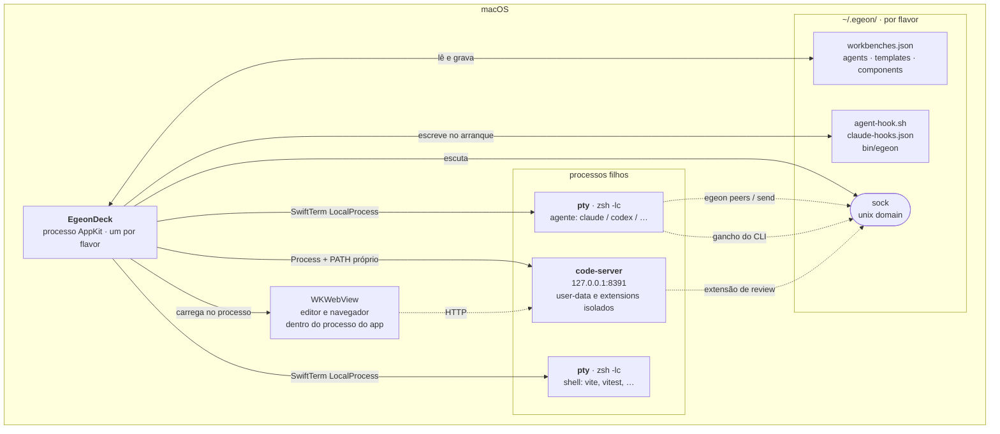
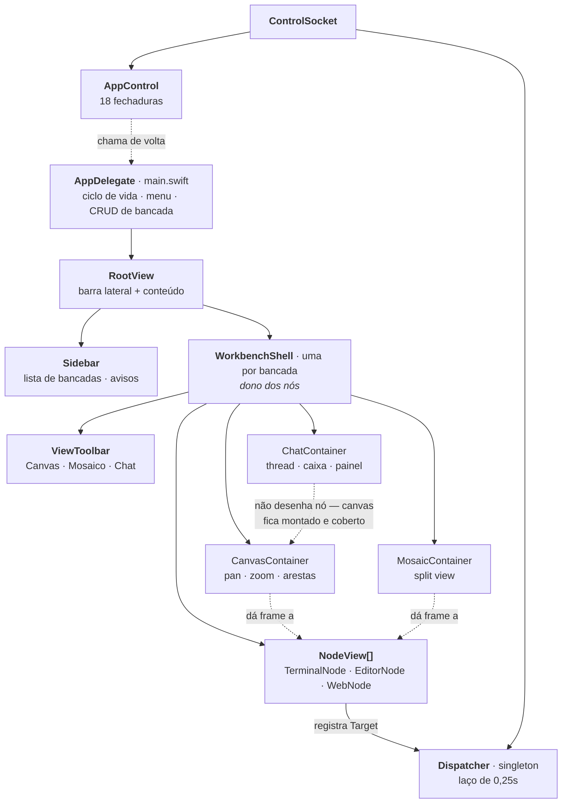
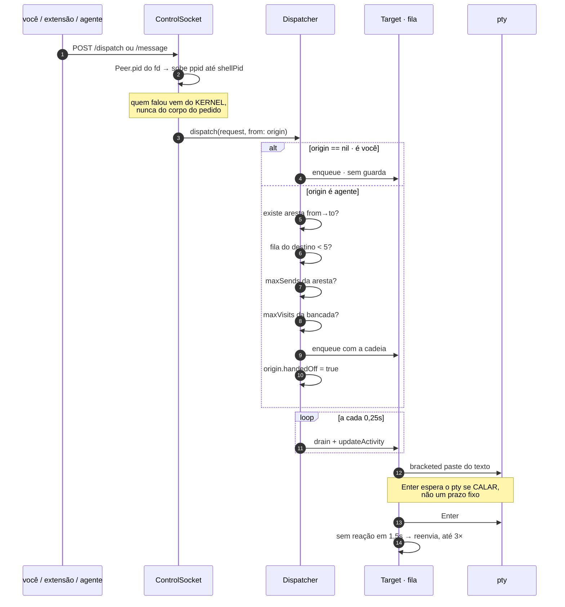
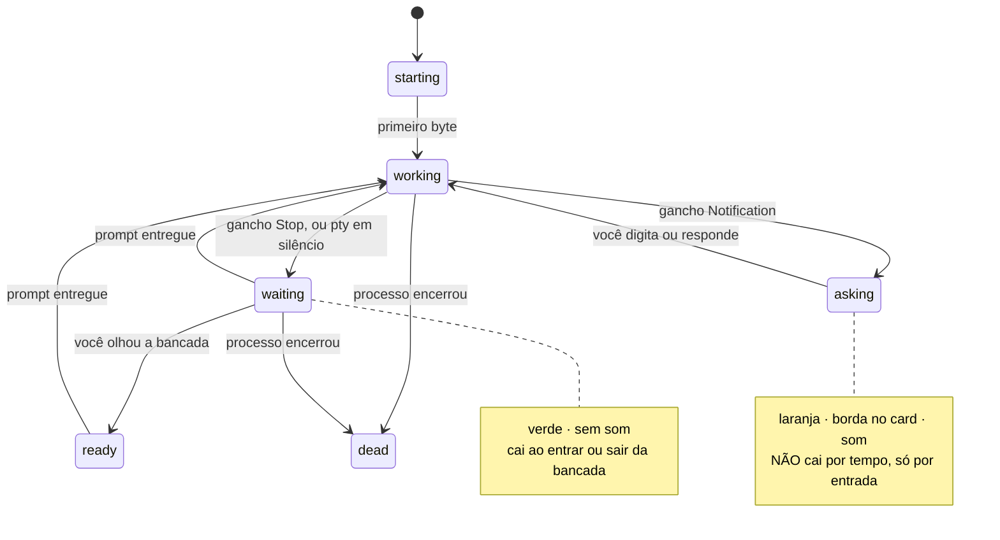
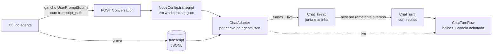
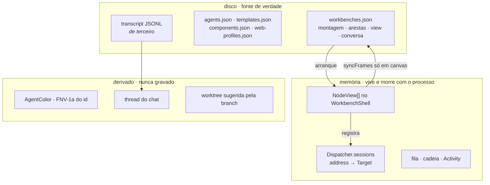

# Egeon Deck — a arquitetura de hoje

Retrato do que existe, para servir de base a proposta de mudança. **Não é ADR**: o
que foi decidido e por quê está em [01-decisoes.md](01-decisoes.md), e o escopo
está em [02-mvp.md](02-mvp.md). Aqui é só o mapa — onde as coisas moram, quem
depende de quem, e onde já dói.

Números deste retrato: 33 arquivos Swift, 16 mil linhas, um executável.

---

## 1. Fronteiras de processo

O app é um processo AppKit que **segura pty diretamente**. Não há daemon, não há
servidor, não há banco. O que existe fora dele são filhos que ele lançou.

Três coisas a notar, porque cada uma amarra o resto:

**O app segura os pty.** Rebuild mata todo agente em andamento — é isto que obriga
os dois flavors (ADR-010). Nenhuma outra decisão de operação faria sentido sem essa.

**O socket é a única porta de entrada.** Extensão do editor, comando `egeon`,
ganchos do CLI e teste de fora: todos entram pelo mesmo lugar. É por isso que ele é
também a ferramenta de verificação — `/peek`, `/chat`, `/shot`, `/compose` existem
porque gesto de mouse e tecla não é dirigível de fora (ADR-003).

**Uma instância por flavor, recusada no arranque.** A segunda sonda o socket e sai
por `exit` antes de carregar o `workbenches.json` — é ter estado em memória que lhe
daria o poder de sobrescrever o da outra (ADR-033).

---

## 2. Dentro do app: quem é dono de quê

**`WorkbenchShell` é o dono dos nós, e isso é a decisão estrutural do módulo de
view.** Antes quem os guardava era o canvas, como `doc.subviews`; com dois
containers disputando o mesmo card a lista teve de subir acima dos dois. Em
qualquer modo o card é o **mesmo** `NodeView` — reparentar não toca no processo, e é
isso que permite trocar de modo com cinco agentes trabalhando (ADR-016).

O modo chat é a exceção que confirma a regra: ele não desenha card nenhum, mas
**também não os desmonta** — o canvas fica montado por baixo, coberto. Nó fora da
hierarquia nunca recebe passe de layout, e sem layout o pty sobe com zero colunas
(ADR-029).

**`main.swift` tem 2753 linhas** e é onde mora tudo que não achou outro lugar:
`AppDelegate`, menu, criação e edição de bancada, worktree, e a fiação inteira do
`AppControl`. É o maior ponto de atrito do arquivo-por-responsabilidade que o resto
do projeto segue.

---

## 3. As três costuras

São os pontos onde se pluga sem abrir o resto. Quem propõe mudança deve olhar aqui
primeiro.

| costura | o que atravessa | quem implementa |
|---|---|---|
| **`AppControl`** | 18 fechaduras `static var` — o socket chama a UI sem conhecê-la | `main.swift` liga todas |
| **`ControlSocket`** | 23 rotas HTTP em unix socket | `ControlSocket.swift` |
| **`ChatAdapter`** | como cada CLI conta a conversa dele | `ClaudeCodeTranscript`; outros ainda não existem |

`AppControl` é fechadura e não protocolo: `static var` opcional que `main.swift`
preenche no arranque. Barato, e o preço é que ninguém sabe quem está ligado sem ler
o `main.swift`.

As 23 rotas: `/targets` `/dispatch` `/peek` `/chat` `/compose` `/geometry` `/layout`
`/mosaic` `/sidebar` `/edge` `/worktree` `/remove` `/activate` `/open` `/view`
`/file` `/change` `/probe` `/shot` `/activity` `/conversation` `/message` `/peers`
`/status`.

Três delas — `/message`, `/peers`, `/status` — respondem sobre **quem perguntou**,
resolvido pelo processo do outro lado da conexão. As demais são dirigidas por
parâmetro.

---

## 4. Um prompt até o pty

Nada nesta cadeia pergunta à TUI se ela está pronta. Toda a lógica é sobre o fluxo
de bytes do pty (ADR-007, ADR-008).

As quatro guardas ficam **todas no app**, e nenhuma depende do que o agente
escreve. O `egeon` nem tem parâmetro para dizer quem é.

---

## 5. Quem diz que o turno acabou

Duas camadas, e a de cima ganha. O CLI que tem gancho **não é julgado pela tela em
momento nenhum** — a tela mente de dois jeitos medidos (ADR-011).

Fim de turno de quem **acabou de acionar um vizinho** não avisa nada: o trabalho
seguiu para o outro card. Pergunta avisa sempre, inclusive no meio de uma cadeia —
permissão não se delega (ADR-024).

---

## 6. O thread do modo chat

O único lugar do app que **lê um arquivo de terceiro** como fonte de verdade.

Duas propriedades caem de graça dessa escolha, e as duas são o motivo dela: o thread
**volta inteiro no arranque seguinte** sem o app guardar mensagem nenhuma, e a
**ordem entre agentes é a real**, porque o timestamp é do CLI e não do app.

A unidade é o **turno**, não a mensagem: mensagem solta ordenada por tempo
intercala duas conversas e a resposta do A cai no meio da sua terceira pergunta ao B
— cisma de piso. Turno acionado por outro agente não é bloco de primeiro nível: ele
entra no cartão de quem o acionou, achatado, com o nome de quem falou dentro da
bolha (ADR-029).

---

## 7. Onde o estado vive

O que é derivado é derivado de propósito. Cor de agente por hash porque campo de cor
no arquivo é mais uma coisa para manter, e paleta à mão em bancada de cinco acaba em
dois tons de azul.

---

## 8. Invariantes

Regras que, quebradas, quebram tudo — e cada uma já custou uma vez.

| invariante | o que acontece se quebrar |
|---|---|
| todo caminho novo passa por `Flavor.current.config(_:)` | o segundo app acha a porta do code-server tomada, conclui que é órfã e **mata o do outro** |
| uma instância por flavor, e um bundle em disco por flavor | mesmos terminais abertos duas vezes; bancadas com o snapshot de quem gravou por último |
| quem falou vem do pid do socket, nunca do pedido | omitir o campo passava por você e não encontrava guarda nenhuma |
| copiar nó nunca copia `conversationId` nem `transcript` | a segunda bancada não abre a conversa; card com TUI desenhada e processo morto, sem erro à vista |
| endereço é `bancada/id`, e é estável | renomear a bancada quebraria o `/dispatch` da extensão — daí o `Dispatcher.rekey` |
| `syncFrames` só roda em canvas | a montagem inteira seria regravada com o tamanho dos painéis |
| worktree sai sempre do checkout principal | worktree dentro de worktree; apagar a de fora leva a de dentro |

---

## 9. Onde dói hoje

Observações com evidência, não opinião. É daqui que uma proposta deve mirar.

**`main.swift` acumula.** 2753 linhas com `AppDelegate`, menu, CRUD de bancada,
worktree e a fiação das 18 fechaduras. O resto do projeto é arquivo por
responsabilidade; este é o que sobrou.

**O modo chat relê por relógio, não por evento.** `ChatContainer` roda a 0,5s e
relê a cauda de cada transcript. Com quatro agentes são quatro arquivos por tick.
`DispatchSource` em vnode resolveria, e o laço existe porque foi o caminho curto.

**`ChatThread.nest` é O(n²).** Para cada turno varre todos procurando o pai
(`turns.last { … }`). Roda a cada tick, e o custo cresce com o tamanho da conversa.

**O thread não virtualiza.** 500 turnos constroem 500 cartões de uma vez, todos com
subviews.

**As arestas são só de leitura no chat.** Era o motivo declarado de querer o modo —
montar a orquestração sem abrir o canvas — e ficou de fora por escolha consciente. Os
chips de `alcança` já estão lá; falta torná-los controle.

**Entrega para `todos` repete seu texto N vezes.** A junção que existia morreu
quando o turno virou a unidade do thread.

**Só um CLI tem adapter.** `codex`, `gemini` e `opencode` não rendem thread. A
costura existe; as implementações, não.

**Atividade de quem não tem gancho é heurística de silêncio.** Vale para shell e
para todo CLI sem `--settings` nosso. Funciona, mas é a única parte do estado que
não vem de fato relatado.

**Dois lugares onde o app escreve fora da casa dele** — a extensão em
`.vscode/settings.json` do repo aberto, e o `~/.config/code-server/config.yaml` que
não é isolado. Registrado como pendência secundária em
[02-mvp.md](02-mvp.md#pendências-declaradas).

**O que nunca foi verificado de fora**: clique e tecla. Dobra de caminho, `Tab` do
destinatário, lista do `@`, gaveta de processo. `screencapture` do shell é negado por
Gravação de Tela e `System Events keystroke` por Acessibilidade — as duas medidas, as
duas negadas. O que existe cobre o desenho estático (`/shot`) e o texto do thread
(`/chat`), e foi por isso que `/compose` nasceu.
