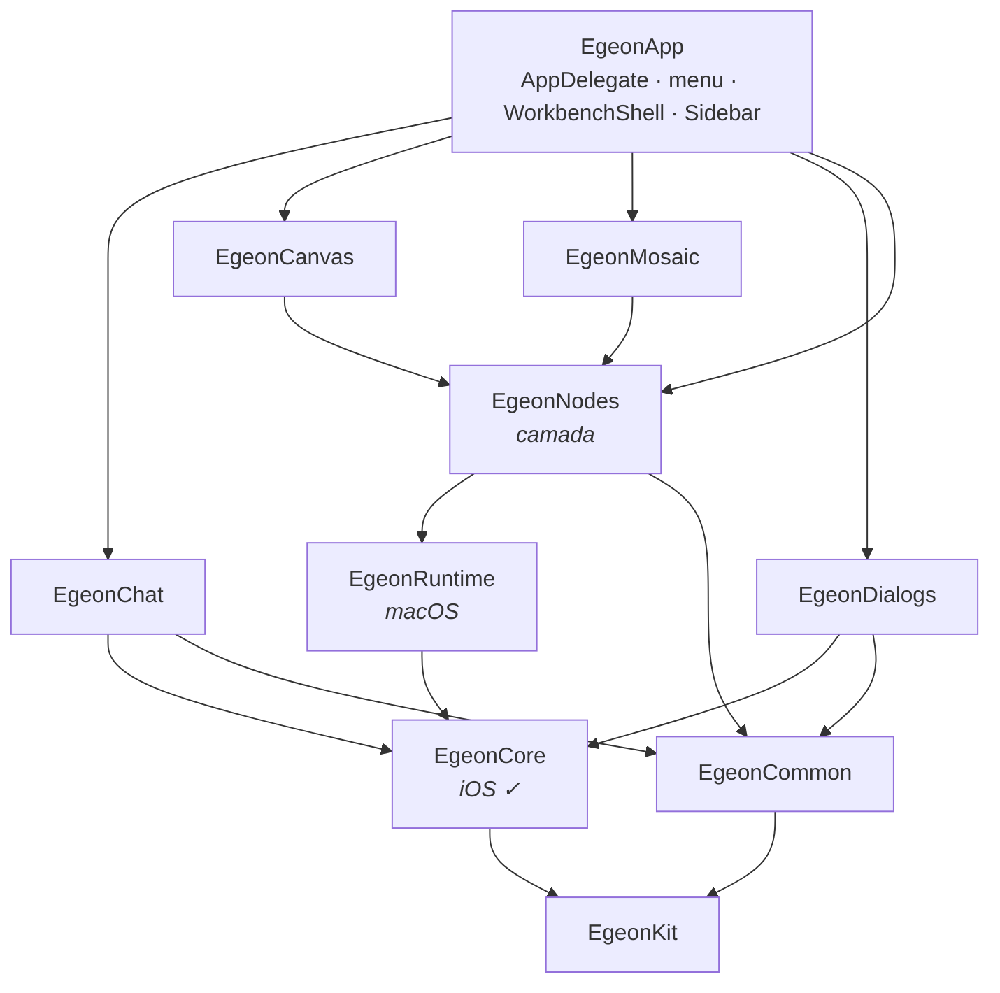

# Egeon Deck — a arquitetura modular

**Este é o destino, não o estado.** Hoje são 34 arquivos num diretório plano e um
alvo executável só. O retrato do que existe está em
[03-arquitetura.md](03-arquitetura.md); as decisões e o que elas custaram, em
[01-decisoes.md](01-decisoes.md).

O `CLAUDE.md` só passa a descrever isto quando a migração começar de fato — doc que
descreve pasta inexistente manda todo agente procurar o que não está lá.

---

## Por que módulo, e não pasta

**No Swift, pasta não é fronteira.** Dentro de um mesmo target todos os arquivos se
veem, independente de onde estão. `Core/`, `Common/`, `Features/` como pasta dariam
zero garantia — seriam convenção, e convenção é exatamente o que este projeto não
consegue sustentar.

A razão é medida, e é sobre quem escreve o código: **este projeto é desenvolvido
quase todo por LLM**, e o perfil de erro é conhecido. Renomear um tipo estourou em
três arquivos e foi corrigido em segundos, porque o compilador cobrou. Uma função que
MEDE texto e outra que o DESENHA, trezentas linhas distantes no mesmo arquivo,
produziram quatro bugs numa sessão — porque o acordo entre elas era convenção, e
convenção falha em silêncio.

Daí a regra que organiza tudo abaixo: **fronteira que o compilador cobra vale mais
que arquivo pequeno.** Target é lei; pasta é arrumação.

---

## As leis

| lei | quem cobra |
|---|---|
| feature não conhece feature | compilador |
| `EgeonCore` não conhece UI | compilador |
| `EgeonCore` compila para iOS | CI |
| `EgeonCommon` não conhece domínio | compilador |
| `EgeonNodes` é **camada**, não feature | emenda explícita, ver abaixo |

**A emenda sobre `Nodes` existe porque o reparenting acopla os modos por
construção.** O mesmo `NodeView` troca de container entre canvas e mosaico sem tocar
no processo (ADR-016), então canvas, mosaico e a casca precisam do mesmo tipo. Medido:
`NodeView` é referenciado 25× em `Canvas.swift`, 16× em `Mosaic.swift`, 7× em
`WorkbenchShell.swift`. Fingir que são features independentes exigiria indireção por
protocolo que seria pura cerimônia. Então `Nodes` é declarado camada, e a lei vale
entre quem está acima dela.

O **chat é a prova de que a lei se paga**: ele não referencia `NodeView` em uma linha
de código — a única ocorrência no arquivo é um comentário explicando que `ChatNode` é
retrato e não referência. Ele já obedece a lei, e por decisão registrada.

---

## Os módulos

```
app/
├── Package.swift
└── Sources/
    ├── EgeonApp/                     executável · raiz de composição
    │   ├── EgeonApp.swift               AppDelegate · ciclo de vida
    │   ├── Menu.swift
    │   ├── Composition/
    │   │   ├── AppWiring.swift          o que era a fiação do AppControl
    │   │   └── ControlSurface+App.swift conforma o protocolo do socket
    │   └── Shell/
    │       ├── WorkbenchShell.swift     dono dos nós · troca de modo
    │       ├── ViewToolbar.swift
    │       └── Sidebar.swift
    │
    ├── Core/
    │   ├── EgeonKit/                 Log · Flavor · Environment
    │   ├── EgeonCore/                modelo · store · parsing  ← compila para iOS
    │   │   ├── Model/
    │   │   ├── Store/
    │   │   └── Transcript/
    │   ├── EgeonRuntime/             processo · dispatch · socket  ← macOS só
    │   │   ├── Process/
    │   │   ├── Dispatch/
    │   │   └── Control/
    │   └── EgeonCommon/
    │       ├── Tokens/               valor cru · Foundation puro
    │       └── Materialization/      NSColor · GlassPanel · AppKit
    │
    ├── EgeonNodes/                   CAMADA · NodeView + terminal/editor/web
    │
    └── Features/
        ├── EgeonChat/                Model · Data · ViewModel · View
        ├── EgeonCanvas/              Model · View
        ├── EgeonMosaic/              View
        └── EgeonDialogs/             formulários de componente e de worktree
```

Dez targets. `Features/` e `Core/` são só caminho no `Package.swift` — o compilador
nem os vê, e existem para o humano.

### Por que `Core` e `Runtime` são separados

**Não é escolha, é o compilador.** `Foundation.Process` **não existe no iOS**;
`fork`/`exec`, pty e o servidor de socket não compilam lá. No mesmo target dos
modelos, o alvo portável morre no dia um — ou vira floresta de `#if os()`.

A linha de corte é exatamente a portabilidade, que é a única que se verifica:

| `EgeonCore` · iOS ✓ | `EgeonRuntime` · macOS |
|---|---|
| `WorkbenchConfig` · `NodeConfig` · `EdgeConfig` | `Dispatcher` · fila · guardas · cadeia |
| `AgentProfile` · `Component` · `Template` | `CodeServer` · `Worktree` · `AgentHooks` |
| `WorkbenchStore` · `Flavor` | `ControlSocket` · `Peer` · `EgeonCLI` |
| `ChatTurn` · `ChatBlock` · `ChatAdapter` · parsing | |

Dentro do `Runtime` as pastas `Process/`, `Dispatch/` e `Control/` separam à vista.
Não são targets porque **não há linha verificável entre elas** hoje — inventar
fronteira que o compilador não cobra é criar a convenção que a lei existe para evitar.
Quando `Runtime` crescer e a linha aparecer, parte.

### E a portabilidade tem de ser verificada

**Um job de CI compilando `EgeonCore` para iOS desde o primeiro dia.** Sem isso ela
apodrece por convenção — que é o modo de falha medido lá no começo. É "o compilador
cobra" aplicado à portabilidade.

---

## O grafo



O `EgeonChat` **não** aponta para `EgeonNodes` nem para `EgeonRuntime`. É o que o
torna a única feature portável para iOS hoje.

---

## Onde cada arquivo de hoje vai

| target | arquivos de hoje |
|---|---|
| `EgeonKit` | `Log` · `Flavor` · `Environment` |
| `EgeonCore` | `Workbench` · `AgentProfile` · `Component` · `Template` · `Transcript` · `Chat` (modelo) · `Activity` (de `Attention`) |
| `EgeonRuntime` | `Dispatcher` · `CodeServer` · `Worktree` · `AgentHooks` · `ControlSocket` · `Peer` · `EgeonCLI` |
| `EgeonCommon` | `Glass` · `ToolbarButton` · `ChatStyle` · `AgentChip` · `DisclosureLine` · `Spinner` · `AttentionSound` |
| `EgeonNodes` | `NodeView` e `TerminalNode` (de `Canvas`) · `Editor` · `WebNode` · `Drop` |
| `EgeonCanvas` | `CanvasContainer` (de `Canvas`) · `Edge` |
| `EgeonMosaic` | `Mosaic` |
| `EgeonChat` | `ChatView` (views) · `ChatComposer` · `ChatPanel` · `ChatContainer` |
| `EgeonDialogs` | `ComponentDialog` · `NodeWorktree` |
| `EgeonApp` | `main` **partido** · `WorkbenchShell` · `ViewToolbar` · `Sidebar` |

Dois arquivos **partem**, e é onde está o trabalho de verdade:

`Canvas.swift` (1591 linhas) declara `NodeView`, `TerminalNode`, `MBTerminalView` **e**
`CanvasContainer`. Os três primeiros são camada; o último é feature.

`Attention.swift` declara `Activity` (estado, Foundation) junto com `Spinner` e
`AttentionSound` (AppKit) — e o `Activity.color` devolve `NSColor`.

---

## As duas inversões que a fronteira força

Não são refatoração cosmética: sem elas os módulos não compilam separados.

### 1. `TerminalSurface` — o Dispatcher para de conhecer view

`Dispatcher.swift` importa AppKit em cinco lugares:

```swift
private(set) weak var view: MBTerminalView?
init(address:profile:view: MBTerminalView, hooked:)
private func inject(_ prompt: String, mode: String?, into view: MBTerminalView)
let responder = window.firstResponder as? NSView       // isFocused
NSEvent.addLocalMonitorForEvents(matching: [.keyDown]) // quem digitou
```

O protocolo mora no `EgeonRuntime`; `TerminalNode` conforma:

```swift
public protocol TerminalSurface: AnyObject {
    var shellPid: pid_t { get }
    var isFocused: Bool { get }
    func send(_ text: String)
    func screen(lines: Int) -> [String]
}
```

O monitor de `NSEvent` **sai** do Runtime: quem tem as views chama
`dispatcher.userTyped(address:)`.

**E isso paga duas vezes.** Com uma superfície falsa, a fila, as quatro guardas, a
cadeia e o reenvio-após-1,5s ficam testáveis sem subir app. São dois dos três bugs de
lógica que a sessão de 20/08 produziu.

### 2. `Activity` separa estado de apresentação

| vai para | o quê |
|---|---|
| `EgeonCore` | o `enum Activity` — os seis estados |
| `EgeonCommon` | `label`, `color`, `Spinner`, `AttentionSound` |

Mesmo vício do `AgentColor` no `Chat.swift`: tipo de modelo carregando como se
desenha. Ali o hash FNV-1a vai para o Core e o mapa índice→cor para o Common.

---

## O padrão interno de uma feature

`Model` · `Data` · `ViewModel` · `View` — e **nenhuma das quatro é obrigatória.**

Pasta obrigatória vazia é convenção que ninguém verifica, que é o modo de falha deste
projeto. A pasta nasce quando o segundo arquivo precisa dela.

**`Data/` só onde há fonte de dado.** Hoje é só o chat: o `ChatAdapter` é literalmente
isso, e é por ele que entra o segundo CLI.

**`ViewModel/` só onde há transformação entre modelo e tela.** `EgeonCanvas` e
`EgeonNodes` **não têm**, e o argumento correto não é "não têm estado" — posição, zoom
e arestas são estado, e persistem. É que esse estado **é modelo**: vive no
`WorkbenchConfig`, e a view o muta direto, sem camada de tradução. ViewModel ali seria
caixa de passagem — e ViewModel-por-convenção é exatamente fronteira que o compilador
não cobra.

Está escrito aqui para que ninguém "corrija" a assimetria em seis meses.

---

## Ordem de migração

Cada passo é **um commit que compila**. E o primeiro risco não é código, é toolchain:
`make.sh`, `dev.sh`, `install.sh`, flavors e assinatura assumem um alvo só.

| # | passo | por quê nesta posição |
|---|---|---|
| 0 | quebrar `Dispatcher` → view com `TerminalSurface`, **sem mover arquivo** | é o acoplamento que impede qualquer separação; verde e commitado antes de mexer em estrutura |
| 1 | `Package.swift` multi-target com **um piloto barato**: `Transcript` | fan-out 0 medido. Valida `make.sh`, assinatura e flavors com churn mínimo |
| 2 | `EgeonKit` e `EgeonCommon` | folhas, sem domínio |
| 3 | `EgeonCore`, e o CI de iOS junto | a portabilidade nasce verificada |
| 4 | `EgeonRuntime` | depende do passo 0 |
| 5 | `EgeonChat` | cluster mais isolado |
| 6 | `EgeonNodes`, partindo o `Canvas.swift` | a parte difícil, com o resto já estável |
| 7 | `EgeonCanvas` · `EgeonMosaic` · `EgeonDialogs` | |
| 8 | `WorkbenchShell` para o `EgeonApp` | **por último**: é o dono dos nós e toca tudo |

E aproveitar a janela: quando o `Core` ficar Foundation-only, ele fica testável sem
subir app. Parsing de transcript, resolução de `cwd` e nome de worktree são lógica
pura com armadilha documentada (ADR-017, ADR-018). **Zero teste mais refactor grande é
onde LLM falha calado** — teste no Core é a versão barata de "o compilador cobra".

---

## Regras que passam a valer

**O `import` no topo declara o que o arquivo pode tocar.** É a documentação que não
mente e que o compilador mantém. Arquivo em feature que importa outra feature não
compila.

**Teste vive no `Core`**, e é onde ele é barato: sem UI, sem processo, sem app. O que
não é testável ali é sinal de que está no módulo errado.

**Prefixo `Egeon*` em todo target.** Não é estética: módulo com o mesmo nome de um tipo
interno cria colisão de lookup qualificado em Swift — `Canvas.Canvas` é poço conhecido
e sem contorno bom.

**Módulo novo precisa de razão verificável.** Se a fronteira não é cobrada pelo
compilador nem pelo CI, é pasta — e pasta vai dentro de um target existente.
